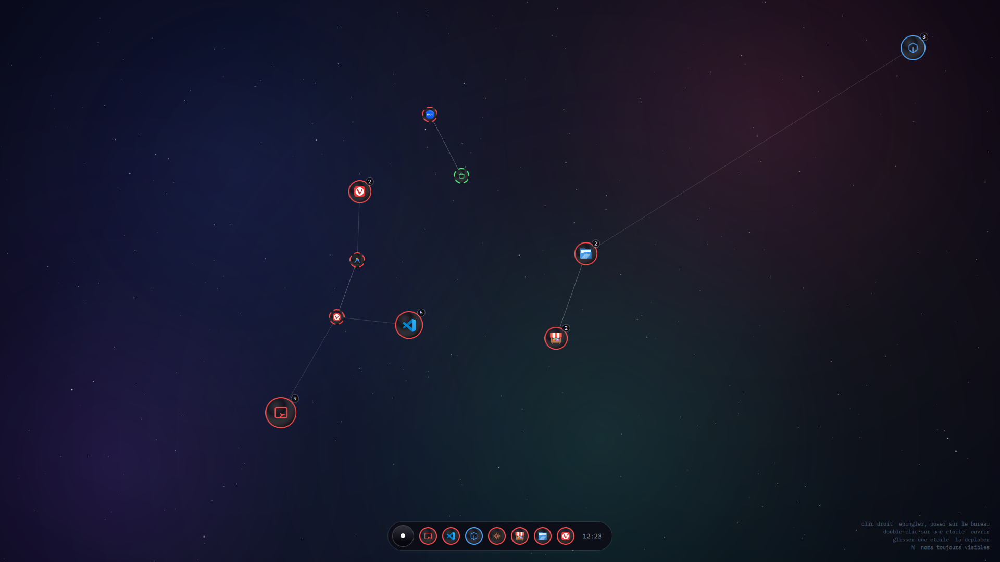

# Constellation — la pièce



## La capture, et ce qu'elle prouve

**`constellation-2026-08-25.png` — 1920 × 1080, prise le 2026-08-25 à 12 h 23
sur `s`, la machine du projet.**

| | |
|---|---|
| Machine | LENOVO 10T7002CUS, Intel Core i5-8400T |
| Rendu | **Mesa Intel UHD Graphics 630 (CFL GT2)**, pilote `i915` |
| Image | `44.20260824`, `sha256:c73f90ed…` |
| Session | `kwin_wayland`, `XDG_CURRENT_DESKTOP=S`, sans `plasmashell` |

**Ce n'est pas `llvmpipe`.** C'est la première pièce de cette Galerie rendue par
une vraie carte graphique, et cela lève pour Constellation la réserve *JAMAIS
JUGÉE SUR GPU* que le dossier impose aux transparences et aux dégradés. Ce qu'on
voit ici est ce que la machine affiche, pas ce qu'un rendu logiciel en approche.

La règle d'entrée demandait une image prise sur la machine qui fait tourner
l'œuvre. Le dossier attendait cette image depuis le 2026-08-22. La voici.

## Ce que la capture corrige dans ce dossier

L'index de la Galerie décrivait encore Constellation comme *« une page servie
par son pont `s-etoiles` »*. **C'est faux depuis le 2026-08-24.** Constellation
est un client Wayland natif : un processus, une fenêtre, une scène QtQuick, qui
appelle le noyau de S dans son propre processus. Plus de serveur HTTP, plus de
port ouvert, plus de moteur de rendu web au démarrage de la session.

La page d'origine n'a pas disparu pour autant — elle est rangée dans
[`archive-page-web/`](archive-page-web/), avec le pont qui la servait. Elle
garde sa valeur : c'est la maquette dont tout le vocabulaire visuel est sorti,
et la palette de `Theme.qml` en est reprise couleur pour couleur.

## Ce que l'image montre

**Un ciel, et des applications qui y sont des étoiles.** Rien d'autre — pas de
barre des tâches, pas de menu, pas de bureau encombré.

- **La taille dit l'usage.** Une étoile grossit avec le nombre de lancements, sur
  une échelle logarithmique bornée de 30 à 60 pixels. Sans le logarithme, une
  application lancée cent fois écraserait tout le ciel ; sans les bornes, plus
  rien ne serait lisible. Le compteur se lit dans la pastille.
- **La couleur dit le monde.** Rouge pour Linux, bleu pour Windows, vert pour
  Android — la seule information que l'œil prend avant le nom. On voit ici les
  trois : le ciel est peuplé de rouge, une étoile bleue en haut à droite, une
  verte au centre.
- **Les traits relient ce qui se lance ensemble**, et se redessinent quand une
  étoile bouge.
- **L'anneau du bas** garde les épinglées et l'heure. **Rien ne s'anime au
  repos** — c'est la promesse de faible consommation, et elle tient parce que le
  fond est peint une seule fois dans son propre canevas.
- **L'aide reste en bas à droite**, en petit, en permanence. Un bureau qui
  n'affiche ni menu ni étiquette doit dire comment on s'en sert.

Le fond visible est `nebuleuse`, celui par défaut.

## La règle 9, appliquée

**S n'annonce ni Bazzite, ni Fedora, ni Wine, ni Waydroid, ni Proton** — et rien
dans cette image ne les nomme. Le moteur se lit dans le carnet et dans le dépôt,
qui est public ; jamais dans la barre des tâches, parce que l'utilisateur ouvre
*un système*, pas un empilement.

## Reposer la pièce ailleurs

Tout ce qui fait cette apparence entre dans l'image, donc survit à
`bootc upgrade` :

| Quoi | Où |
|---|---|
| La scène et ses composants | `files/usr/share/s/constellation/qml/` |
| La palette, en un seul endroit | `qml/Theme.qml` |
| Les fonds, peints en JavaScript | `qml/Fonds.js` |
| Le programme | `files/usr/bin/s-constellation` |
| Le noyau qu'il appelle | `files/usr/lib/s/noyau.py` |

Rien de tout cela ne vit dans `~/.config`, et c'est délibéré : sur un système
atomique, un thème posé à la main dans le dossier personnel disparaît sans
prévenir à la mise à jour suivante.

Pour l'essayer sans reconstruire une image de plusieurs gigaoctets, le programme
accepte une copie de travail :

```bash
S_NOYAU=~/S/files/usr/lib/s \
S_QML=~/S/files/usr/share/s/constellation/qml \
  ~/S/files/usr/bin/s-constellation
```

## Comment la capture a été prise

Sans interface graphique et sans déranger les fenêtres ouvertes — la recette est
au Grimoire : [`kwin-capturer-la-coquille.sh`](../../grimoire/kwin-capturer-la-coquille.sh).
